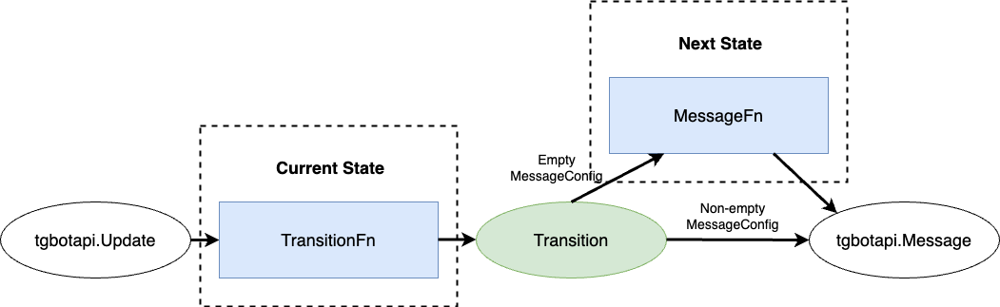

# Golang Telegram Bot Finite State Machine

[](https://pkg.go.dev/github.com/Feolius/telegram-bot-fsm)

Package `Feolius/telegram-bot-fsm` is a wrapper for
[Telegram Bot API Bindings](https://github.com/go-telegram-bot-api/telegram-bot-api)
optimized for direct message (DM) communication.

It is designed to approach direct messaging as a finite-state machine (fsm).
Every user interaction performs a state transition: change the current state
or transit to the same one. Every transition is accompanied by a certain
message from the bot. Package supports payload data modification to make
state switching more senseful.

## Getting started
FSM requires at least one state defined. `UndefinedState` is used to satisfy
this requirement. `UndefinedState` state is used implicitly in case of user's
first interaction with the bot or as a reaction to unsupported command input.
It can be used explicitly in the code as well.

An example of simple echo-bot with a single state (`UndefinedState`):
```go
package main

import (
	"context"
	fsm "github.com/Feolius/telegram-bot-fsm"
	tgbotapi "github.com/go-telegram-bot-api/telegram-bot-api/v5"
	"log"
	"net/http"
	"os"
)

// Payload is empty, because we don't need to pass any data between states for this bot.
type Data struct{}

type StartCommandHandler struct{}

func (h StartCommandHandler) TransitionFn(ctx context.Context, update *tgbotapi.Update, data Data) (fsm.Transition, Data) {
	// "/start" command transits the bot into UndefinedState.
	return fsm.StateTransition(fsm.UndefinedState), data
}

type UndefinedStateHandler struct{}

// MessageFn returns a message configuration for default state.
func (h UndefinedStateHandler) MessageFn(ctx context.Context, data Data) fsm.MessageConfig {
	// This message will be shown when "/start" command is used, since it transits the bot into UndefinedState.
	return fsm.TextMessageConfig("Type any message and it will be sent back to you")
}

// TransitionFn describes how to switch to another states. In this case, we don't need to change state, because we have the only one state.
func (h UndefinedStateHandler) TransitionFn(ctx context.Context, update *tgbotapi.Update, data Data) (fsm.Transition, Data) {
	if update.Message == nil || update.Message.Text == "" {
		return fsm.TextTransition("This message should never be sent"), data
	}
	return fsm.TextTransition(update.Message.Text), data
}

func main() {
	bot, err := tgbotapi.NewBotAPI(os.Getenv("TELEGRAM_APITOKEN"))
	if err != nil {
		log.Fatal(err)
	}

	updates := bot.ListenForWebhook("/" + bot.Token)
	go func() {
		log.Printf("serving port " + os.Getenv("PORT"))
		err = http.ListenAndServe("0.0.0.0:"+os.Getenv("PORT"), nil)
		if err != nil {
			log.Fatalf("cannot start server: %s", err)
		}
	}()

	// Optional command configuration.
	commands := make(map[string]fsm.TransitionProvider[Data])
	commands["start"] = StartCommandHandler{}

	// State configuration. Map key is a state's name.
	configs := make(map[fsm.State]fsm.StateHandler[Data])
	// UndefinedState is the only state we need for this bot and it is required to be provided.
	configs[fsm.UndefinedState] = UndefinedStateHandler{}

	botFsm := fsm.NewBotFsm(bot, configs, fsm.WithCommands[Data](commands))

	ctx := context.TODO()
	for update := range updates {
		err = botFsm.HandleUpdate(ctx, &update)
		// Error handling...
	}
}

```

This simple bot can do 2 things: respond with a description message on
`/start` command and send any text message back to a user. Using this
package for an echo-bot is an overkill, but it shows the main concept.

You can find more examples in the [examples](examples) folder.

## FSM configuration

FSM configuration is generic and has a type of `map[fsm.State]fsm.StateHandler[T]`.
The `fsm.State` key of this map is the name of the state. `T` is a type of
payload data that will be operated during state transitions.

`fsm.StateHandler` is defined as follows.
```go
type StateHandler[T any] interface {
    MessageConfigProvider[T]
    TransitionProvider[T]
}

type MessageConfigProvider[T any] interface {
    MessageFn(ctx context.Context, data T) MessageConfig
}

type TransitionProvider[T any] interface {
    TransitionFn(ctx context.Context, update *tgbotapi.Update, data T) (Transition, T)
}
```

`MessageConfigProvider` returns a `MessageConfig` used to create Telegram
message that will be sent when switching to this state.

```go
type MessageConfig struct {
    // ChatId field is ignored.
    tgbotapi.MessageConfig
    // These messages are sent right after the main one.
    // Note: params from embedded MessageConfig (e.g. ReplyMarkup or ParseMode) will be applied for all of them.
    ExtraTexts []string
    // If true, it will send and remove RemoveKeyboard message prior to main message sending.
    RemoveKeyboard bool
}
```

FSM `MessageConfig` extends `tgbotapi.MessageConfig` with some extra
information, that allows sending of several messages in a row and removing
current keyboard.

`TransitionProvider` is the core of FSM state logic. Here you will define
all state switching rules and data modifications. `TransitionFn` returns
`Transition` object and data. `Transition` object defines the next state
bot must switch to. Returned payload data will be passed as an argument
to `MessageFn` and `TransitionFn` of the next state.

```go
const AddTaskNameState = "add-task-name"
const AddTaskDescriptionState = "add-task-description"

type Task struct {
    name        string
    description string
}

type Data struct {
    newTask Task
}

type AddTaskNameStateHandler struct{}

func (h AddTaskNameStateHandler) MessageFn(ctx context.Context, data Data) fsm.MessageConfig {
    // This message will be shown, when moving to AddTaskNameState.
    return fsm.TextMessageConfig("Enter task name")
}

func (h AddTaskNameStateHandler) TransitionFn(ctx context.Context, update *tgbotapi.Update, data Data) (fsm.Transition, Data) {
    if update.Message == nil {
        return fsm.TextTransition("Please specify task name"), data
    }
    // A new task name is populated with user's response.
    data.newTask.name = update.Message.Text
    // Transit to the next state.
    // TransitionFn and MessageFn of AddTaskDescriptionState will get the updated data.
    return fsm.StateTransition(AddTaskDescriptionState), data
}
// ...
configs := make(map[fsm.State]fsm.StateHandler[Data])
configs[AddTaskNameState] = AddTaskNameStateHandler{}
```

`Transition` has the following structure.

```go
type Transition struct {
    State
    MessageConfig
}
```

`State` is the name of the state (that key in the config map) you
want to transit to. Besides target state, you can also define the bot's
transition message with `MessageConfig`. Both `State` and `MessageConfig`
are optional. If `State` is empty, the bot keeps the current state. If
`MessageConfig` is empty, target `MessageFn` will be called to get message
information. If `MessageConfig` is not empty, target `MessageFn` won't be
called. Thus, transition `MessageConfig` _overrides_ `MessageProvider`
behaviour.

`fsm.StateTransition(state fsm.State)` and `fsm.TextTransition(text string)`
are 2 helper factories that create `Transition` with `State`
and `MessageConfig.Text` respectively.

Here is the simplified pipeline.


## External state switch

Sometimes you need to change current user's state and send a message
by some external trigger. A common example is sending notifications.
With FSM you can achieve that using the `GoTo` method.

```go
err := botFsm.GoTo(context, chatId, transition, data)
```

## Commands

Commands are a common way to interact with bots. You can define command
handlers using the following configuration
`map[string]fsm.TransitionProvider[T]`. Here the map key is a command
_without_ the "/" prefix.

```go
type StartCommandHandler struct{}

func (h StartCommandHandler) TransitionFn(ctx context.Context, update *tgbotapi.Update, data Data) (fsm.Transition, Data) {
    // "/start" command transits the bot into "menu".
    return fsm.StateTransition("menu"), data
}

type FaqCommandHandler struct{}

func (h FaqCommandHandler) TransitionFn(ctx context.Context, update *tgbotapi.Update, data Data) (fsm.Transition, Data) {
    // "/faq" command returns some FAQ text.
    return fsm.TextTransition("Some faq text here"), data
}
// ...
commands := make(map[fsm.State]fsm.TransitionProvider[Data])
commands["start"] = StartCommandHandler{}
commands["faq"] = FaqCommandHandler{}
// Pass commands via fsm.WithCommands wrapper.
botFsm := fsm.NewBotFsm(bot, configs, fsm.WithCommands[Data](commands))
```

Note: When the incoming message is recognized as a command, current user's
state is switched to `UndefinedState` before the handler call. That way
command resets user's state. That makes `TextTransition` usage safe.

## State persistence

`TransitionProvider` implementation may change passed payload data,
and the next state's `TransitionProvider` will receive an updated copy
of the payload data. Data must be kept somewhere between user requests.
By default, it is stored in the memory. That means, all the data will
be lost after the bot's re-run. It's okay during development or for very
simple bots, but in most cases you want the data to be stored. In order
to do that you should implement `PersistenceHandler`.

```go
type PersistenceHandler[T any] interface {
    LoadStateFn(ctx context.Context, chatId int64) (state fsm.State, data T, err error)
    SaveStateFn(ctx context.Context, chatId int64, state fsm.State, data T) error
}
```

`LoadStateFn` is declared to restore state's name and data from persistent
storage. `SaveStateFn` is used to save state's name and data into persistent
storage. Together, these methods provide an ability to manage "session"
data between requests. If load handler returns an empty `state` (e.g. when
a user sends a message for the first time), it is treated as `UndefinedState`.

Persistence handlers can be provided as an option for `NewBotFsm` using
the `fsm.WithPersistenceHandler` function.

```go
type CsvFilePersistenceHandler struct {
    File string
}

// PersistenceHandler implementation here.

botFsm := fsm.NewBotFsm(bot, configs, fsm.WithPersistenceHandler[Data](CsvFilePersistenceHandler{File: File}))
```

## Removing keyboard

There is a known
[issue](https://stackoverflow.com/questions/45995052/how-to-remove-not-to-hide-replykeyboardmarkup-in-telegram-bot-using-c)
with custom [keyboard](https://core.telegram.org/bots/api#replykeyboardmarkup) removal. Sometimes you want to
be sure that this keyboard no longer exists (even though it can be hidden). To achieve that, the
bot must send a message with [ReplyKeyboardRemove](https://core.telegram.org/bots/api#replykeyboardremove) markup.
But like any other telegram bot messages, this message must bear some text. Obviously, this message is pointless.
Luckily, telegram bot API allows removing messages, and this message can be wiped out as well.

FSM supports this hack. There are 2 useful interfaces that any `StateHandler` can implement.
```go
type RemoveKeyboardAfterMarker interface {
	// RemoveKeyboardAfter sends a signal to remove keyboard after bot left the state.
	RemoveKeyboardAfter() bool
}

type RemoveKeyboardBeforeMarker interface {
	// RemoveKeyboardBefore sends a signal to remove keyboard before bot enters the state.
	RemoveKeyboardBefore() bool
}
```

If `RemoveKeyboardAfterMarker` is implemented and `RemoveKeyboardAfter`
returns true, `ReplyKeyboardRemove` message will be sent and removed right
before the current state is switched to the next one.
`RemoveKeyboardBeforeMarker` works similarly, but removes keyboard before
state is switched to the current one.

`RemoveKeyboard` option is also present in a `MessageConfig`. Thus, keyboard
removal can be controlled within `TransitionFn`.

`ReplyKeyboardRemove` message deletion request may take some time due to
Telegram API network delays. In order to improve user experience you can
provide a meaningfull message that will be shown during the delay. By default,
it is "Thinking...", but you can modify that using the `WithRemoveKeyboardTempText`
function as an option for `NewBotFsm`.

```go
botFsm := fsm.NewBotFsm(bot, configs, fsm.WithRemoveKeyboardTempText[Data]("Some text"))
```
